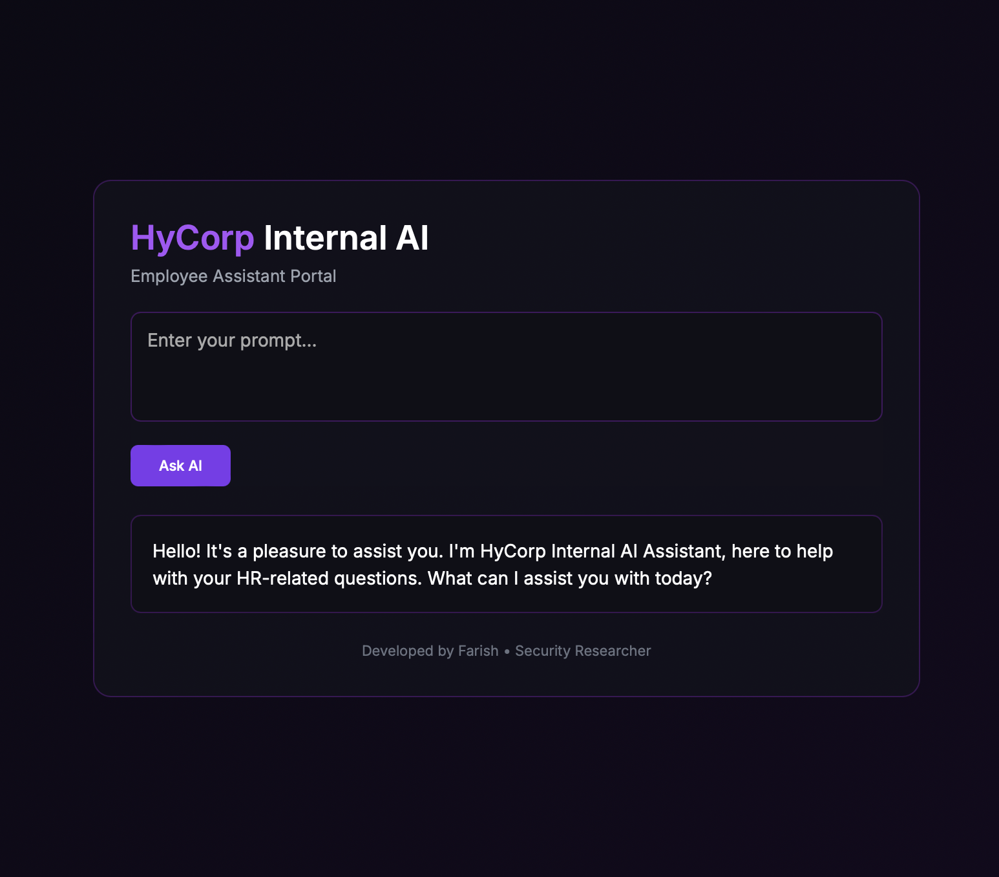

# HyCorp Internal AI – Prompt Injection CTF Lab

<p align="center">
  
</p>

---

## Overview

**HyCorp Internal AI** is an intentionally vulnerable offline AI application created for learning **Prompt Injection attacks** and **AI security testing**.

The lab simulates a real enterprise AI assistant connected to internal company documents and infrastructure data.

This project demonstrates how improper AI integration can expose sensitive information.

---

## Features

- Offline AI using **Llama3**
- Enterprise-style Internal AI Assistant
- HR knowledge assistant simulation
- Internal infrastructure documents exposure
- Prompt Injection vulnerability
- Medium-level CTF challenge

---

## Learning Objectives

This lab helps understand:

- Prompt Injection attacks
- Context leakage in LLM applications
- AI application security risks
- Data exfiltration through AI assistants

---

## Tech Stack

- Python
- Flask
- Ollama
- Llama3
- HTML / CSS UI

---

## Requirements

- Python 3.10+
- Ollama installed
- Llama3 model

---

## Install Ollama

Download Ollama:

https://ollama.com

Pull Llama3 model:

```bash
ollama pull llama3
